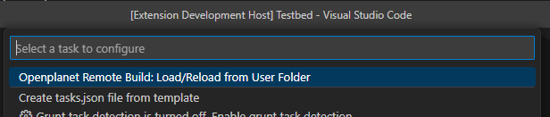

# Openplanet Remote Build Tasks Extension

This extension adds build tasks for compiling [Openplanet](https://openplanet.dev/) plugins. The tasks communicate
with the [Remote Build](https://openplanet.dev/plugin/remotebuild) plugin to trigger script compilation and this must
be installed for the tasks to work.

## Setup

Install the Remote Build plugin in Openplanet. You can find it in the Plugin Manager by searching "Remote Build".

**[Optional]** You can then install the tm-remote-build python executable if you want the plugin to load happen as part
of a larger build script in plugin. Run `python -m pip install --upgrade tm-remote-build` to download and install the
latest version.

## Usage (Simple)

Open vscode so your workspace is inside a plugin folder in the OpenplanetX/Plugins/ folder. If you also have a
`info.toml` file in the top level of your plugin folder than you will see the "Openplanet Remote Build: Load/Reload
from User Folder" task in the available list when you go to add a new task.

> NOTE: tm-remote-build is not required to be installed to use this custom build task. All parts of the loading are
> handled inside the VS Code extension.

Run this task to send a command to Openplanet and have the plugin in your workspace loaded.

## Usage (Custom)

If you have a custom build script to run you will need to create the "Openplanet Remote Build Custom: Load from Custom
Script" task. This task will, by default, call a script called `./build.sh`. You should update the `commandLine` field
in the task definition to match what your script is named.

It is expected that at some point in your build script you will call tm-remote-build to trigger the plugin to load.
